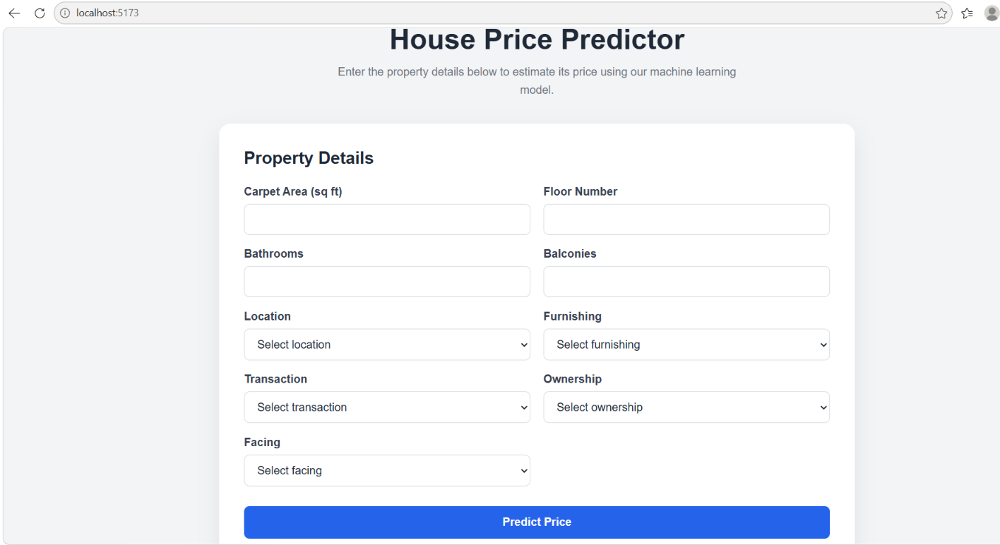
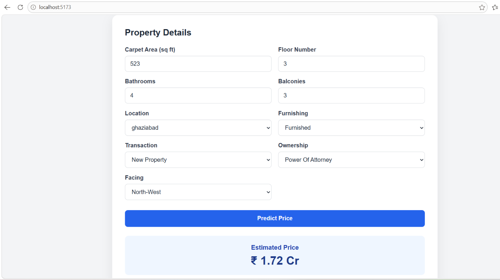

# House Price Prediction — End-to-End ML Web App

An end-to-end machine learning application that predicts residential property prices based on property characteristics.

The project covers the complete machine learning workflow, from data preprocessing and model development to serving predictions through a FastAPI backend and an interactive React frontend.

---

## Project Overview

The objective of this project is to build and deploy a machine learning model capable of estimating house prices using property information such as area, location, number of bathrooms, furnishing status, and other characteristics.

The project includes:

- Data cleaning and preprocessing
- Exploratory data analysis
- Feature engineering
- Categorical feature encoding
- Machine learning model comparison
- Model evaluation
- Exporting a complete scikit-learn Pipeline
- FastAPI prediction API
- React + TypeScript frontend
- Input validation and error handling
- Automated API testing
- Docker containerization

---

## Machine Learning

Two regression approaches were evaluated:

1. Linear Regression
2. Gradient Boosting Regression

### Model Performance

| Model | MAE | RMSE | R² |
|---|---:|---:|---:|
| Linear Regression | 4,458,566 | 8,862,136 | 0.567 |
| Gradient Boosting | 3,633,172 | 7,569,748 | 0.684 |

Gradient Boosting achieved the best test performance and was therefore selected as the final model.

An R² of approximately **0.684** means that the model explains about **68.4% of the variation in house prices in the test data**.

The final preprocessing and Gradient Boosting model were exported together as a complete scikit-learn Pipeline.

---

## Model Features

The final model uses the following property features:

- Carpet area
- Floor number
- Number of bathrooms
- Number of balconies
- Location
- Furnishing status
- Transaction type
- Ownership type
- Property facing direction

The API converts frontend inputs into the exact feature structure expected by the trained model.

Unknown locations are mapped to the `other` category before prediction.

---

## Project Structure

```text
house-price-project/
│
├── backend/
│   ├── app/
│   │   ├── api/
│   │   │   └── routes/
│   │   │       └── prediction.py
│   │   ├── core/
│   │   │   └── config.py
│   │   ├── schemas/
│   │   │   └── prediction.py
│   │   ├── services/
│   │   │   ├── inference.py
│   │   │   └── preprocessing.py
│   │   ├── utils/
│   │   │   └── logging_config.py
│   │   └── main.py
│   │
│   ├── models/
│   │   ├── house_price.pkl
│   │   └── locations.json
│   ├── tests/
│   │   └── test_prediction.py
│   ├── .env.example
│   ├── Dockerfile
│   └── requirements.txt
│
├── frontend/
│   ├── public/
│   │   └── locations.json
│   ├── src/
│   │   ├── App.tsx
│   │   ├── App.css
│   │   ├── index.css
│   │   └── main.tsx
│   ├── .env.example
│   ├── package.json
│   └── vite.config.ts
│
├── notebooks/
│   ├── house_price_model.ipynb
│   └── locations.json
│
├── .gitignore
└── README.md
```

---

## Backend API

The backend was developed using **FastAPI**.

### Available Endpoints

#### Health Check

```http
GET /health
```

Response:

```json
{
  "status": "ok"
}
```

#### House Price Prediction

```http
POST /predict
```

Example request:

```json
{
  "carpet_area_sqft": 1200,
  "floor_num": 3,
  "bathroom": 2,
  "balcony": 1,
  "location": "other",
  "furnishing": "Furnished",
  "transaction": "Resale",
  "ownership": "Freehold",
  "facing": "East"
}
```

Example response:

```json
{
  "predicted_price": 6388916.198046595
}
```

FastAPI also provides interactive API documentation at:

```text
http://localhost:8000/docs
```

### Example Prediction Using curl

```bash
curl -X POST "http://localhost:8000/predict" \
  -H "Content-Type: application/json" \
  -d '{
    "carpet_area_sqft": 1200,
    "floor_num": 3,
    "bathroom": 2,
    "balcony": 1,
    "location": "other",
    "furnishing": "Furnished",
    "transaction": "Resale",
    "ownership": "Freehold",
    "facing": "East"
  }'
```

---

## Frontend

The frontend was developed using:

- React
- TypeScript
- Vite
- CSS

The user can enter property information through a web form and receive a predicted property price.

The frontend includes:

- Numeric inputs for area, floor, bathrooms, and balconies
- Dropdown menus for categorical features
- Location options loaded from `locations.json`
- Required-field validation
- Carpet area validation
- Loading state while waiting for a prediction
- API error handling
- User-friendly price formatting in Indian Rupees, Lac, and Crore

---

## Environment Variables

### Frontend

| Variable | Description | Example |
|---|---|---|
| `VITE_API_BASE_URL` | The address of the FastAPI backend used by the React frontend | `http://localhost:8000` |

The frontend uses:

```text
frontend/.env

---

## Running the Backend Locally

From the project root:

```bash
cd backend
```

Install the dependencies:

```bash
pip install -r requirements.txt
```

Start FastAPI:

```bash
uvicorn app.main:app --reload
```

The API will be available at:

```text
http://localhost:8000
```

---

## Running the Frontend

Open another terminal:

```bash
cd frontend
```

Install dependencies:

```bash
npm install
```

Start the Vite development server:

```bash
npm run dev
```

Open:

```text
http://localhost:5173
```

---

## Docker

The FastAPI backend can also run inside Docker.

### Build the Docker Image

From the `backend` directory:

```bash
docker build -t house-price-api .
```

### Run the Container

```bash
docker run --name house-price-api-container -p 8000:8000 house-price-api
```

The Dockerized API will then be available at:

```text
http://localhost:8000
```

You can verify it using:

```text
http://localhost:8000/health
```

---

## Testing

The backend includes automated tests using **pytest** and FastAPI's `TestClient`.

The tests cover:

- Health endpoint
- Successful prediction request
- Invalid request validation

Run the tests from the `backend` directory:

```bash
python -m pytest
```

Current test result:

```text
3 passed
```

---

## Dataset

This project uses the **House Price** dataset available on Kaggle.

Dataset source:

https://www.kaggle.com/datasets/juhibhojani/house-price

The raw dataset is not included in this GitHub repository because the CSV file is larger than GitHub's recommended file-size limit.

### Download Instructions

1. Open the Kaggle dataset page:

   https://www.kaggle.com/datasets/juhibhojani/house-price

2. Sign in to Kaggle if required.

3. Click **Download** to download the dataset.

4. Extract the downloaded ZIP file.

5. Inside this project, create the following folder if it does not already exist:

   ```text
   notebooks/data/

---
## Technologies Used

### Machine Learning
- Python
- pandas
- NumPy
- scikit-learn
- Gradient Boosting Regression

### Backend
- FastAPI
- Pydantic
- Uvicorn
- joblib
- pytest

### Frontend
- React
- TypeScript
- Vite
- CSS

### Deployment & Development
- Docker
- Git
- GitHub

---

## Model Compatibility

The exported model was created using:

```text
scikit-learn 1.9.0
```

The backend pins the same scikit-learn version to maintain compatibility when loading the serialized model.

---

## End-to-End Workflow

```text
Property Details
       ↓
React Frontend
       ↓
Input Validation
       ↓
FastAPI /predict
       ↓
Request Preprocessing
       ↓
Scikit-learn Pipeline
       ↓
Gradient Boosting Model
       ↓
Predicted House Price
       ↓
Formatted Result in Frontend
```

---
## Screenshots

### House Price Prediction Form



### Prediction Result




## Author

**Menna Samy**

House Price Prediction — End-to-End Machine Learning Web Application